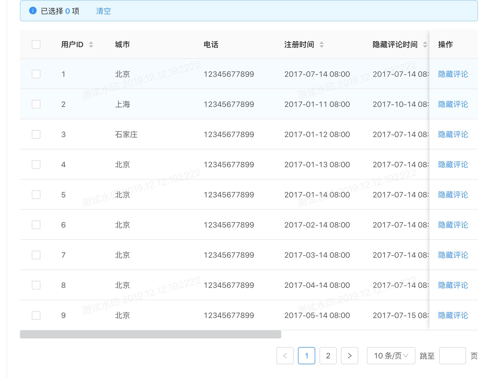

# [watermarkjs](https://github.com/songxing66/watermark)

## [npm](https://www.npmjs.com/package/@songxizi/better-watermark)

`watermark.js`是基于 DOM 对象实现的 BS 系统的水印，确保系统保密性，安全性，降低数据泄密风险，简单轻量，支持多属性配置，动态计算水印，水印防被删（监听水印组件元素删除并重新添加，监听改变水印的属性并重新添加）。

特性：

- 多属性配置，简单易上手
- 动态计算水印
- **水印防被删(监听水印组件元素删除并重新添加，监听改变水印的属性并重新添加)**
- 支持 2 种导入使用：本地引用，npm 引用
- 内置 3 种 API 方法：init()，load(), remove()。
- 原理：pointer-events 事件穿透属性，Shadow DOM(影子 DOM)，opacity 等

## 1、水印插件-使用

### 1.1 本地引入封装的 js 文件

只是简单的加一个很浅的水印，实现起来很容易。不需要引入 jquery 插件。

`watermark.js`是必须要引进的组件

第一步：获取组件方式：`https://github.com/songxing66/watermark`

第二步：clone 后，在需要加水印的相关页面引入水印文件"watermark.js":

```
<script type="text/javascript" src="./watermark.js"></script>
```

第三步：在确保页面 DOM 加载完毕之后，调用 new Watermark() 实例化方法:

```
   <script>new Watermark({ watermark_txt: "测试水印，1021002301，测试水印，100101010111101" })</script>
```



### 1.2 npm 包引入

第一步：npm 获取水印组件包：

```
npm install @songxizi/better-watermark
```

第二步：引入水印模块：

```
import watermark from '@songxizi/better-watermark'
或者
var watermarkDom = require("@songxizi/better-watermark")
```

第三步：在确保页面 DOM 加载完毕之后，调用 watermark 的 load 方法(手动加载):

```

  const watermark=  new Watermark({
	  watermark_txt: "测试水印，1021002301，测试水印，100101010111101"
  })
  watermark.load({ watermark_txt: "测试水印，1021002301，测试水印，100101010111101" })

```

注意：(2)提供了 remove 方法，用来移除水印(单次移除,resize 事件会再次触发渲染)

```
	const watermark=  new Watermark({
		watermark_txt: "测试水印，1021002301，测试水印，100101010111101"
	})
   watermark.remove()
```

## 2、内置方法

### 2.1 new Watermark(setting);

初始化水印，添加 load 和 resize 事件

例子

```js
const watermark = new Watermark({
  watermark_txt: '测试水印，1021002301，测试水印，100101010111101'
});
```

### 2.2 watermark.load(setting);

手动加载水印

例子

```js
watermark.load({
  watermark_txt: '测试水印，1021002301，测试水印，100101010111101'
});
```

### 2.3 watermark.remove();

手动移除水印

例子

```js
watermark.remove();
```

### 2.3 watermark.destroy();

手动移除水印

例子

```js
watermark.destroy();
watermark = null;
```

## 3、支持各种属性配置使用

```
watermark_id: 'wm_div_id', //水印总体的 id
watermark_prefix: 'mask_div_id', //小水印的 id 前缀
watermark_txt:"测试水印", //水印的内容
watermark_x:20, //水印起始位置 x 轴坐标
watermark_y:20, //水印起始位置 Y 轴坐标
watermark_rows:0, //水印行数
watermark_cols:0, //水印列数
watermark_x_space:100, //水印 x 轴间隔
watermark_y_space:50, //水印 y 轴间隔
watermark_font:'微软雅黑', //水印字体
watermark_color:'black', //水印字体颜色
watermark_fontsize:'18px', //水印字体大小
watermark_alpha:0.15, //水印透明度，要求设置在大于等于 0.005
watermark_width:100, //水印宽度
watermark_height:100, //水印长度
watermark_angle:15, //水印倾斜度数
watermark_parent_width:0, //水印的总体宽度（默认值：body 的 scrollWidth 和 clientWidth 的较大值）
watermark_parent_height:0, //水印的总体高度（默认值：body 的 scrollHeight 和 clientHeight 的较大值）
watermark_parent_node:null //水印插件挂载的父元素 element,不输入则默认挂在 body 上

```

上面的属性都支持配置的，怎么使用呢？

基本山需要自己配置的属性：`watermark_txt`,`watermark_color`,`watermark_fontsize`,`watermark_alpha`,`watermark_angle`，`watermark_width`,`watermark_height`这 7 个属性一般是经常用到的，其他属性一般用的偏少。需要用到的就设置一下，不需要用到的就可以不设置，插件内部会有默认值的。

比如 load 方法的属性配置

```

watermark.load({
watermark_txt:"测试水印，saucxs，测试水印，songEagle，工号等", //水印的内容
watermark_color:'#5579ee', //水印字体颜色
watermark_fontsize:'24px', //水印字体大小
watermark_alpha:0.5, //水印透明度，要求设置在大于等于 0.005
watermark_angle:135, //水印倾斜度数
watermark_width:200, //水印宽度
watermark_height:200, //水印长度
});

```

## 5、支持浏览器

Chrome,FireFox,Safari,IE9 及以上浏览器
